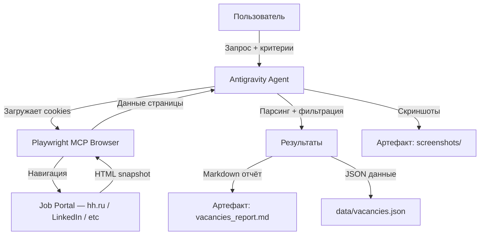

# Job Vacancy Monitoring Agent — Полная инструкция

> **Цель**: Создать агента, который автоматически обходит job-порталы (hh.ru, LinkedIn, Glassdoor, Indeed и др.), собирает релевантные вакансии, фильтрует их по критериям и формирует отчёт — используя **уже авторизованную** браузерную сессию.

---

## 1. PRD (Product Requirements Document)

### 1.1 Проблема

Ручной мониторинг вакансий на нескольких порталах занимает 1–2 часа в день. Многие сайты требуют авторизации для просмотра контактов, зарплат и полных описаний. Нужен агент, работающий от имени авторизованного пользователя.

### 1.2 Целевой пользователь

Соискатель (или рекрутер), у которого есть активные аккаунты на job-порталах и который хочет автоматизировать сбор и фильтрацию вакансий.

### 1.3 Функциональные требования

| ID    | Требование                                                   | Приоритет |
|-------|--------------------------------------------------------------|-----------|
| FR-01 | Авторизация через сохранённые cookies/storageState           | P0        |
| FR-02 | Навигация по заданным поисковым URL                          | P0        |
| FR-03 | Парсинг списка вакансий (название, компания, зарплата, ссылка) | P0        |
| FR-04 | Переход на страницу каждой вакансии и сбор полного описания  | P1        |
| FR-05 | Фильтрация по ключевым словам, зарплате, локации            | P0        |
| FR-06 | Формирование отчёта (Markdown / JSON / CSV)                 | P0        |
| FR-07 | Пагинация — обход нескольких страниц результатов             | P1        |
| FR-08 | Дедупликация вакансий между запусками                        | P2        |
| FR-09 | Уведомление о новых вакансиях с момента последнего запуска   | P2        |

### 1.4 Нефункциональные требования

- **Устойчивость**: Агент должен корректно обрабатывать rate-limiting, капчи и таймауты.
- **Прозрачность**: Каждый шаг логируется; при ошибке — скриншот страницы для отладки.
- **Безопасность**: Cookies/storageState хранятся локально, никогда не передаются вовне.
- **Идемпотентность**: Повторный запуск с теми же параметрами не дублирует данные.

---

## 2. Выбор архитектуры

### 2.1 Варианты и сравнение

```
┌─────────────────────────────────────────────────────────────────────┐
│                     Архитектурные варианты                          │
├─────────────────┬──────────────────┬────────────────────────────────┤
│ Вариант         │ Плюсы            │ Минусы                        │
├─────────────────┼──────────────────┼────────────────────────────────┤
│ A. Playwright   │ Полноценный      │ Тяжелее, нужен Node/Python    │
│    MCP          │ браузер, cookies,│ runtime                       │
│    (рекоменд.)  │ JS-рендеринг,    │                               │
│                 │ встроен в        │                               │
│                 │ Antigravity      │                               │
├─────────────────┼──────────────────┼────────────────────────────────┤
│ B. HTTP +       │ Быстро, легко    │ Не работает с SPA,            │
│    Cheerio      │                  │ нет JS-рендеринга,            │
│                 │                  │ cookie mgmt вручную           │
├─────────────────┼──────────────────┼────────────────────────────────┤
│ C. Puppeteer    │ Хорошая экосист. │ Нет MCP-интеграции,           │
│                 │                  │ дублирует Playwright           │
├─────────────────┼──────────────────┼────────────────────────────────┤
│ D. Selenium     │ Взрослый, stable │ Медленный, тяжёлый,           │
│                 │                  │ устаревший API                │
└─────────────────┴──────────────────┴────────────────────────────────┘
```

### 2.2 Рекомендованная архитектура: Playwright MCP + Antigravity Agent



**Почему Playwright MCP:**
1. Уже доступен как MCP-сервер в Antigravity
2. Поддержка `storageState` для cookies
3. Полный JS-рендеринг (SPA-совместимость)
4. Accessibility snapshots для структурированного парсинга
5. Встроенные скриншоты для отладки

---

## 3. Управление сессией / Cookies

### 3.1 Первоначальный сбор cookies

> **ВАЖНО**: Этот шаг выполняется ОДИН РАЗ вручную.

**Шаг 1**: Запустить Playwright-браузер и открыть целевой сайт:

```javascript
// Через Playwright MCP — открыть страницу авторизации
// Инструмент: mcp_playwright_browser_navigate
// URL: https://hh.ru/account/login
```

**Шаг 2**: Авторизоваться вручную (пользователь вводит логин/пароль в открытом браузере).

**Шаг 3**: Сохранить storage state:

```javascript
// Через mcp_playwright_browser_run_code
async (page) => {
  const context = page.context();
  const state = await context.storageState();
  // Вернуть state как JSON
  return JSON.stringify(state, null, 2);
}
```

**Шаг 4**: Записать результат в файл `auth/hh_state.json` через `write_to_file`.

### 3.2 Загрузка cookies при каждом запуске

```javascript
// Через mcp_playwright_browser_run_code
async (page) => {
  const fs = require('fs');
  const state = JSON.parse(fs.readFileSync('auth/hh_state.json', 'utf8'));
  const context = page.context();
  await context.addCookies(state.cookies);
  return 'Cookies loaded successfully';
}
```

### 3.3 Альтернатива: userDataDir (Chrome Profile)

Если MCP Playwright настроен с `--user-data-dir`, браузер автоматически использует сохранённый профиль Chrome со всеми cookies. Для этого нужно добавить в конфиг MCP:

```json
{
  "playwright": {
    "launchOptions": {
      "channel": "chrome",
      "userDataDir": "C:/Users/<username>/AppData/Local/Google/Chrome/User Data"
    }
  }
}
```

### 3.4 Проверка авторизации

Перед началом парсинга ВСЕГДА проверять, что сессия активна:

```javascript
// Навигация на защищённую страницу
// mcp_playwright_browser_navigate → https://hh.ru/applicant/resumes
// Затем mcp_playwright_browser_snapshot
// Если в snapshot есть "Войти" или "Login" — сессия истекла
```

---

## 4. Пошаговая имплементация агента

### Фаза 0: Структура проекта

```
project/
├── auth/                        # Storage states (gitignored!)
│   ├── hh_state.json
│   ├── linkedin_state.json
│   └── glassdoor_state.json
├── config/
│   └── search_config.json       # Поисковые критерии
├── data/
│   ├── vacancies.json           # Собранные вакансии
│   └── seen_ids.json            # Дедупликация
├── reports/
│   └── vacancies_report.md      # Последний отчёт
├── scripts/
│   ├── collect_cookies.js       # Скрипт сбора cookies
│   └── parse_vacancies.js       # Основной парсер
├── .gitignore                   # auth/ обязательно в gitignore
└── README.md
```

### Фаза 1: Конфигурация поиска

Создать `config/search_config.json`:

```json
{
  "portals": [
    {
      "name": "hh.ru",
      "enabled": true,
      "searchUrls": [
        "https://hh.ru/search/vacancy?text=DevOps+engineer&area=113&salary=&currency_code=RUR&experience=between3And6&order_by=publication_time&search_period=3",
        "https://hh.ru/search/vacancy?text=SRE+engineer&area=113&experience=between3And6&order_by=publication_time&search_period=3"
      ],
      "authStateFile": "auth/hh_state.json",
      "selectors": {
        "vacancyCard": "[data-qa='serp-item']",
        "title": "[data-qa='serp-item__title']",
        "company": "[data-qa='vacancy-serp__vacancy-employer']",
        "salary": "[data-qa='vacancy-serp__vacancy-compensation']",
        "link": "[data-qa='serp-item__title']",
        "nextPage": "[data-qa='pager-next']"
      }
    },
    {
      "name": "linkedin",
      "enabled": false,
      "searchUrls": [
        "https://www.linkedin.com/jobs/search/?keywords=DevOps&location=Portugal"
      ],
      "authStateFile": "auth/linkedin_state.json",
      "selectors": {
        "vacancyCard": ".job-card-container",
        "title": ".job-card-list__title",
        "company": ".job-card-container__primary-description",
        "link": ".job-card-list__title a"
      }
    }
  ],
  "filters": {
    "keywords_include": ["DevOps", "SRE", "Platform", "Infrastructure", "Kubernetes"],
    "keywords_exclude": ["Junior", "Intern", "Стажёр"],
    "min_salary_rub": 250000,
    "locations": ["Москва", "Remote", "Удалённая работа"]
  },
  "settings": {
    "max_pages_per_search": 3,
    "delay_between_pages_ms": 2000,
    "delay_between_vacancies_ms": 1000,
    "take_screenshots": true,
    "output_format": "markdown"
  }
}
```

### Фаза 2: Основной алгоритм агента

```
АЛГОРИТМ: collect_vacancies

1. ЗАГРУЗИТЬ config/search_config.json
2. ДЛЯ КАЖДОГО портала (где enabled=true):
   a. ЗАГРУЗИТЬ cookies из authStateFile
   b. ПРОВЕРИТЬ авторизацию (навигация, snapshot, поиск "Войти")
   c. ЕСЛИ не авторизован:
      - УВЕДОМИТЬ пользователя: "Сессия на {portal} истекла"
      - ПРЕДЛОЖИТЬ ре-авторизацию
      - ПРОПУСТИТЬ портал
   d. ДЛЯ КАЖДОГО searchUrl:
      i.   НАВИГАЦИЯ на URL
      ii.  ОЖИДАНИЕ загрузки (wait_for vacancy card selector)
      iii. СКРИНШОТ (если enabled)
      iv.  SNAPSHOT страницы
      v.   ПАРСИНГ карточек вакансий:
           - Извлечь: title, company, salary, link, location
      vi.  ФИЛЬТРАЦИЯ по keywords_include / keywords_exclude / min_salary
      vii. ДЛЯ КАЖДОЙ подходящей вакансии:
           - ЕСЛИ vacancy_id NOT IN seen_ids:
             * НАВИГАЦИЯ на страницу вакансии
             * ОЖИДАНИЕ загрузки
             * SNAPSHOT / ПАРСИНГ полного описания
             * ДОБАВИТЬ в результаты
             * ДОБАВИТЬ id в seen_ids
             * ЗАДЕРЖКА delay_between_vacancies_ms
      viii. ПАГИНАЦИЯ:
           - ЕСЛИ есть кнопка "Следующая" И текущая страница < max_pages:
             * КЛИК на "Следующая"
             * ВЕРНУТЬСЯ к шагу ii
           - ИНАЧЕ: ПЕРЕЙТИ к следующему searchUrl
      ix.  ЗАДЕРЖКА delay_between_pages_ms
3. СОХРАНИТЬ seen_ids в data/seen_ids.json
4. СОХРАНИТЬ все вакансии в data/vacancies.json
5. СГЕНЕРИРОВАТЬ отчёт в reports/vacancies_report.md
6. УВЕДОМИТЬ пользователя о результатах
```

### Фаза 3: Playwright MCP — маппинг инструментов

| Шаг алгоритма        | Инструмент Playwright MCP                          |
|-----------------------|-----------------------------------------------------|
| Загрузка cookies      | `mcp_playwright_browser_run_code` (addCookies)      |
| Навигация             | `mcp_playwright_browser_navigate`                    |
| Ожидание загрузки     | `mcp_playwright_browser_wait_for`                    |
| Скриншот              | `mcp_playwright_browser_take_screenshot`              |
| Парсинг страницы      | `mcp_playwright_browser_snapshot` / `browser_evaluate`|
| Клик (пагинация)      | `mcp_playwright_browser_click`                       |
| Ввод поиска           | `mcp_playwright_browser_type`                        |
| Выполнение JS         | `mcp_playwright_browser_evaluate`                    |
| Массовый парсинг      | `mcp_playwright_browser_run_code`                    |

### Фаза 4: Парсинг данных

```javascript
// Пример: Извлечение вакансий с hh.ru через browser_evaluate
async (page) => {
  const cards = await page.$$eval('[data-qa="serp-item"]', items =>
    items.map(item => ({
      id: item.getAttribute('data-vacancy-id'),
      title: item.querySelector('[data-qa="serp-item__title"]')?.textContent?.trim(),
      company: item.querySelector('[data-qa="vacancy-serp__vacancy-employer"]')?.textContent?.trim(),
      salary: item.querySelector('[data-qa="vacancy-serp__vacancy-compensation"]')?.textContent?.trim(),
      link: item.querySelector('[data-qa="serp-item__title"]')?.href,
      location: item.querySelector('[data-qa="vacancy-serp__vacancy-address"]')?.textContent?.trim(),
      date: item.querySelector('[data-qa="vacancy-serp__vacancy-date"]')?.textContent?.trim()
    }))
  );
  return JSON.stringify(cards, null, 2);
}
```

### Фаза 5: Формат отчёта

```markdown
# 📋 Отчёт по вакансиям — {дата}

**Портал**: hh.ru
**Запросов**: 2 | **Найдено**: 47 | **После фильтрации**: 12 | **Новых**: 8

---

## 🆕 Новые вакансии

### 1. Senior DevOps Engineer — Яндекс
- **Зарплата**: от 350 000 ₽
- **Локация**: Москва / Remote
- **Ссылка**: [Открыть](https://hh.ru/vacancy/12345678)
- **Ключевые навыки**: Kubernetes, Terraform, CI/CD
- **Описание**: ...краткое описание...

### 2. SRE — VK
- **Зарплата**: 300 000 – 450 000 ₽
- ...

---

## 📊 Статистика
| Метрика              | Значение |
|----------------------|----------|
| Всего просмотрено    | 47       |
| Подходящих           | 12       |
| Новых с прошлого раза| 8        |
| Средняя зарплата     | 340 000 ₽|
```

---

## 5. Обработка ошибок и Edge Cases

### 5.1 Проблемы и решения

| Проблема                    | Решение                                                       |
|-----------------------------|---------------------------------------------------------------|
| Сессия истекла              | Проверка auth перед стартом → уведомление пользователя        |
| Капча                       | Скриншот + пауза → запрос к пользователю решить вручную       |
| Rate limiting (429)         | Экспоненциальный backoff: 2s → 4s → 8s → уведомление         |
| Изменение вёрстки           | Fallback на `browser_snapshot` (accessibility tree)           |
| Пустые результаты           | Логирование URL + скриншот → ревью конфигурации               |
| Таймаут загрузки            | Retry 3 раза с увеличивающейся задержкой                      |
| Блокировка IP               | Уведомление + пауза на 30 минут                              |

### 5.2 Anti-detection чеклист

- [ ] Использовать реалистичный User-Agent (уже настроен в Playwright)
- [ ] Случайные задержки между действиями (1–3 секунды)
- [ ] Не открывать более 50 страниц за сессию
- [ ] Имитировать скролл перед парсингом
- [ ] Использовать `{ javaScriptEnabled: true }` (по умолчанию)
- [ ] НЕ запускать в headless-режиме для сайтов с anti-bot protection

---

## 6. Запуск агента — Workflow для Antigravity

### Быстрый запуск (однократный)

Скажите Antigravity:

```
Запусти агента мониторинга вакансий:
1. Загрузи cookies из auth/hh_state.json
2. Обойди поисковые URL из config/search_config.json
3. Собери вакансии, отфильтруй по критериям
4. Сохрани результаты в data/vacancies.json
5. Создай отчёт в reports/vacancies_report.md
```

### Сбор cookies (первый раз)

```
Помоги собрать cookies для hh.ru:
1. Открой https://hh.ru/account/login в браузере
2. Подожди, пока я авторизуюсь
3. После моего подтверждения — сохрани storageState в auth/hh_state.json
```

### Периодический запуск

```
Проведи ежедневную проверку вакансий:
1. Проверь актуальность cookies (если просрочены — предупреди меня)
2. Обойди все включённые порталы
3. Покажи только НОВЫЕ вакансии, которых не было в прошлом отчёте
4. Обнови seen_ids.json
```

---

## 7. Расширения (roadmap)

| Фаза | Функциональность                                 | Сложность |
|------|--------------------------------------------------|-----------|
| v1.1 | Telegram-уведомления о новых вакансиях           | Medium    |
| v1.2 | AI-скоринг релевантности (сравнение с резюме)    | Medium    |
| v1.3 | Автоматический отклик (заполнение формы)         | High      |
| v1.4 | Мониторинг по расписанию (cron / Task Scheduler) | Low       |
| v1.5 | Dashboard (веб-интерфейс для просмотра)          | High      |
| v2.0 | Multi-agent: один агент на портал, оркестратор   | High      |

---

## 8. Безопасность

> [!CAUTION]
> **Никогда** не коммитьте файлы из `auth/` в git. Добавьте `auth/` в `.gitignore`.

> [!WARNING]
> Storage state содержит session cookies. Храните файлы только локально.
> Периодически обновляйте cookies (сессии истекают через 1–30 дней в зависимости от сайта).

> [!IMPORTANT]
> Соблюдайте Terms of Service каждого портала. Не нагружайте серверы чрезмерным количеством запросов.
> Используйте разумные задержки (2–5 секунд между запросами).
